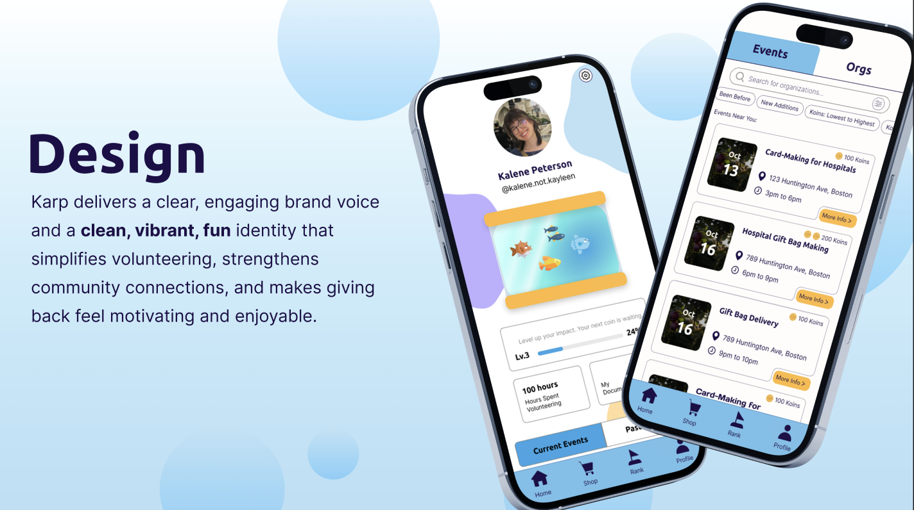
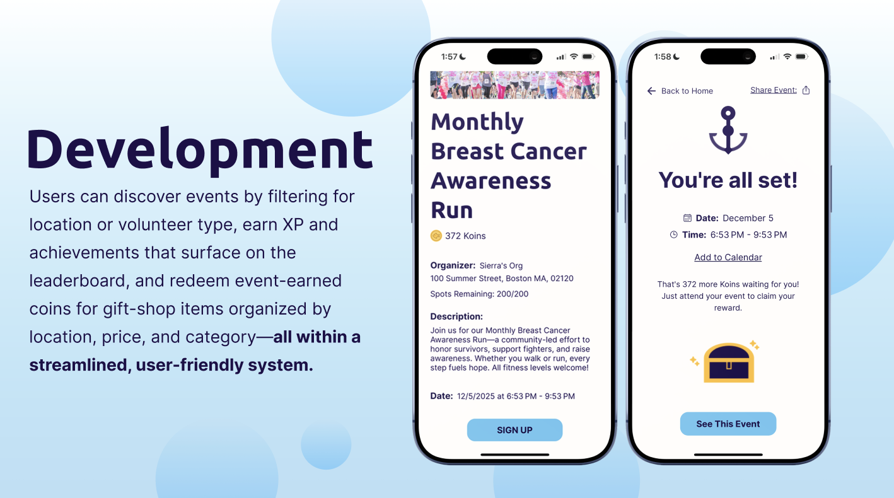
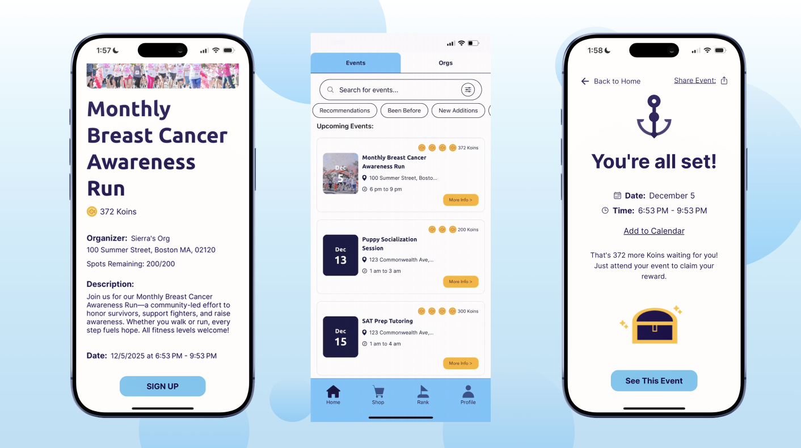
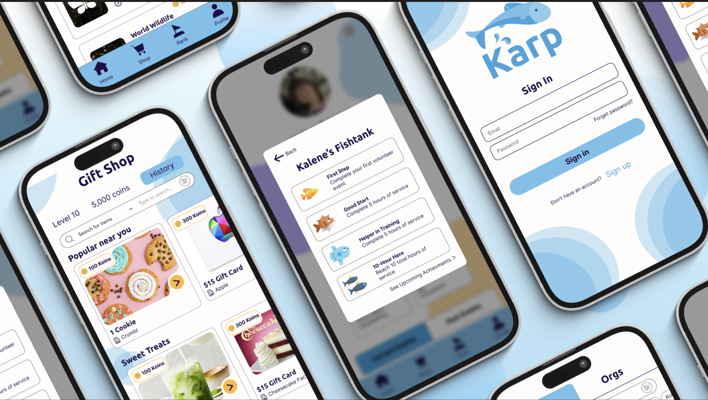

# KARP
Karp is a platform that gamifies the volunteering experience to encourage young adults to give back to their community.

## Overview

KARP consists of three applications:

### Backend
Python / FastAPI / MongoDB

[View Backend →](./backend)

### Web Application
React / TypeScript

[View Web Frontend →](./web)

### Mobile Application
React Native / Expo

[View Mobile App →](./mobile)

## Architecture

                    ┌──────────────────┐
                    │   React Web App  │
                    └────────┬─────────┘
                             │
                             │
                    ┌────────▼─────────┐
                    │   KARP Backend   │
                    │ Python / FastAPI │
                    └───────┬───┬──────┘
                            │   │
                   ┌────────▼┐ ┌▼──────────┐
                   │ MongoDB │ │  AWS S3   │
                   └─────────┘ └───────────┘
                            ▲
                            │
                    ┌───────┴──────────┐
                    │ React Native App │
                    └──────────────────┘

## Key Features

- Volunteer Event Discovery & Recommendations — Search, filter, sort, and discover volunteer opportunities based on causes, qualifications, availability, location, and personalized recommendations.
- Volunteer Profiles & Gamification — Track volunteering hours, XP, levels, achievements, and progress through an interactive fish-tank achievement system.
- Event Management & Check-In — Sign up for events, manage upcoming/completed events, view attendees, add events to a calendar, and check in/out using QR codes.
- KARP Coin Marketplace — Browse and purchase rewards from vendors using KARP Coins, with filtering by category, location, offers, and cost, and QR-based item redemption.
- Organization & Vendor Portal — Create, edit, draft, and manage events and marketplace items, generate QR codes, and track approval/activation status.
- Admin Portal — Review and approve/reject submitted events and marketplace items.
- Leaderboards & Social Features — View volunteer rankings and other volunteers' profiles, including hours, levels, and XP.
- Authentication & Account Management — Volunteer registration, login/logout, password recovery, profile management, and account settings.

## Technologies

- React
- React Native
- TypeScript
- Python
- FastAPI
- MongoDB
- AWS S3

### App Demo

